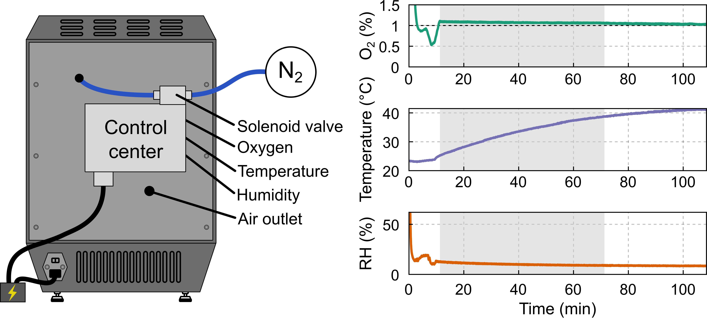

# vpp-postcuring-oxygen-control
# Atmosphere-Controlled Post-Curing Chamber for Vat Photopolymerization (VPP)

Python and Arduino-based environmental monitoring and oxygen-control system for atmosphere-controlled UV post-curing of vat-photopolymerized components.

Developed at the Technical University of Denmark (DTU) for research purposes. The oxygen-control system can also be applied to any commercial additive manufacturing system to control the environment while printing.


Associated publication:

> Artemeva, M. et al.
> *Atmosphere-controlled post-curing enables dimensional stabilization and extended life of vat-photopolymerized soft tooling for injection molding*
> 

---

# Overview

This repository contains the control software, wiring documentation, and operational guide for a modified UV post-curing chamber equipped with:

* oxygen monitoring,
* humidity monitoring,
* temperature monitoring,
* nitrogen-assisted atmosphere control,
* environmental data logging,
* live visualization of curing conditions.

The system was developed to investigate the influence of oxygen-controlled post-curing on the thermo-mechanical evolution and durability of vat-photopolymerized (VPP) soft tooling.

The setup combines:

* Arduino-based hardware control,
* Python-based monitoring and data acquisition,
* relay-controlled nitrogen flow,
* environmental sensing,
* and live plotting/export of curing parameters.

---

# Repository Structure

```text
vpp-postcuring-oxygen-control/

├── README.md
├── LICENSE
├── requirements.txt
│
├── arduino/
│   └── arduino_control_fan.ino
│
├── python/
│   └── arduino_terminal_fan.py
│
├── docs/
    ├── guide_to_oxygen_control.pdf
    └── fritzing_diagram_oxygen_control.pdf

```

---

# Hardware Components

The environmental control setup includes:

* Arduino Uno
* Oxygen sensor module
* DHT temperature/humidity sensor
* Relay modules
* Nitrogen solenoid valve
* Circulation fan
* External power supply
* UV post-curing chamber/3D printer

The wiring configuration is shown in:

```text
docs/fritzing_diagram_oxygen_control.pdf
```

---

# Software Requirements

## Python Version

Recommended:

```text
Python 3.12
```

Other versions may work but were not extensively tested.

## Required Python Packages

Install dependencies using:

```bash
pip install -r requirements.txt
```

The following packages are required:

* pyserial
* matplotlib
* numpy
* pandas

---

# Arduino Setup

Upload the Arduino sketch:

```text
arduino/arduino_control_fan.ino
```

using Arduino IDE before running the Python interface.

The Arduino board communicates with the Python terminal interface through serial communication.

---

# Running the System

## Step 1 — Connect Arduino

Connect the Arduino board to the PC using USB.

## Step 2 — Identify COM Port

Check the Arduino COM port in Arduino IDE and update:

```python
COM_PORT = 'COM7'
```

inside:

```text
python/arduino_terminal_fan.py
```

according to your system configuration.

## Step 3 — Run Python Interface

Execute:

```bash
python arduino_terminal_fan.py
```

The terminal interface allows:

* starting/stopping fan,
* setting oxygen concentration,
* enabling nitrogen control,
* live plotting,
* CSV export,
* environmental monitoring.

---

# Data Export

Environmental data are exported as CSV files containing:

* oxygen concentration,
* humidity,
* temperature,
* oxygen setpoint,
* time evolution.

These files can be further analyzed in MATLAB, Python, or Excel.

---

# Documentation

Detailed operational instructions are provided in:

```text
docs/guide_to_oxygen_control.pdf
```

including:

* software setup,
* VSCode configuration,
* Arduino communication,
* oxygen control workflow,
* nitrogen tank operation,
* post-curing procedure,
* troubleshooting.

---

# Safety Notice

This setup uses nitrogen gas and electrically actuated valves.

Users are fully responsible for:

* safe laboratory operation,
* gas handling,
* electrical safety,
* pressure regulation,
* and compliance with local institutional safety procedures.

The software and hardware documentation are provided exclusively for research reproducibility purposes and are not certified for industrial or safety-critical operation.

---

# Reproducibility

This repository is intended to support reproducibility of the experimental methodology reported in the associated publication.

The repository includes:

* environmental monitoring scripts,
* oxygen-control logic,
* hardware schematics,
* and operational documentation.

---

# Citation

If you use this repository in academic work, please cite:

```text
Artemeva, M. et al.
Atmosphere-controlled post-curing enables dimensional stabilization and extended life of vat-photopolymerized soft tooling for injection molding.

```

---

# License

This repository is distributed under the MIT License.

---

# Contact

Marina Artemeva
Technical University of Denmark (DTU)
Department of Civil and Mechanical Engineering
Kgs. Lyngby, Denmark

Email: [maart@dtu.dk](mailto:maart@dtu.dk)

Venkata Karthik Nadimpalli
Technical University of Denmark (DTU)
Department of Civil and Mechanical Engineering
Kgs. Lyngby, Denmark

Email: [vkna@dtu.dk](mailto:vkna@dtu.dk)
